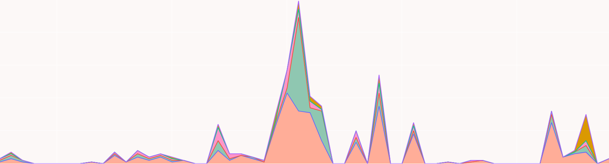

# INTRODUCTION À LA FOUILLE DE TEXTE AVEC PYTHON (École normale supérieure ULM, 20 février 2023)



Ce cours fait partie du cours d'[*Introduction générale aux humanités numériques*](https://odhn.ens.psl.eu/article/introduction-generale-aux-humanites-numeriques) (ENS ULM, 2022-2023, responsable pédagogique Léa Saint-Raymond). 
Il vise à introduire aux possibilités d'extraction d'informations et d'analyse statistique depuis
un corpus de texte brut, en Python. 

--- 

## PRÉSENTATION

### Question de recherche
Quelle est la représentation de cinq genres littéraires du XVIIIe siècle
(poésie, théâtre, roman, littérature d'idées) dans un corpus datant du XIXe siècle de catalogues de 
vente de manuscrits ?

### Prérequis techniques

Aucun (c'est pratique!), même savoir lire du code Python est un petit plus.

---

## LES NOTEBOOKS

Ces cours sont disponibles sur Google Colab et en Jupyter notebooks. 
Il existe une légère différence entre les notebooks Jupyter et ceux sur Google Colab: ceux sur
Google Collab ne présentent pas l'utilisation de la librairie Python OS.

- [0_introduction](./0_introduction.ipynb): présentation générale du programme et des compétences vues
  - sur [Google Colab](https://colab.research.google.com/drive/1HmtwxMbiCQz4wed-tY57Qf-AI5EpL6Ux?usp=sharing)
- [1_fouille_texte](./1_fouille_texte.ipynb): le notebook principal. fouille et visualisation d'un corpus textuel
  - sur [Google Colab](https://colab.research.google.com/drive/1NHCg4HiTZVZbeZqeSMJthFw6r5TYzqCB?usp=sharing)
- [2_bonus_creation_corpus](./2_bonus_creation_corpus.ipynb): notebook secondaire indiquant comment les corpus utilisés
  à l'étape 1 ont été créés. Ce notebook introduit à des concepts importants: qu'est ce que c'est qu'une API et
  comment l'utiliser pour créer un corpus de recherche.
  - sur [Google Colab](https://colab.research.google.com/drive/15veTQ_VsmwAwG9RAijibkO9COg3QuDq-?usp=sharing)
- [3_ressources_supplementaires](./3_ressources_supplementaires.ipynb): quelques ressources supplémentaires sur
  Python, les humanités numériques et les expressions régulières.
  - sur [Google Colab](https://colab.research.google.com/drive/1DIM-zHq230x6fyZRoKOuYIf3K7udxloB?usp=sharing)

Je conseille fortement d'utiliser jupyter notebook, qui est gratuit, open source, ne repose pas sur le 
vol des données des utilisateur.ice.s, sur lequel Google Colab est basé et, surtout, qui vous permet 
de motifier le code, de sauvegarder votre version de tester des trucs sans danger.  Il faut installer 
Jupyter Notebook si on veut l'utiliser (j'explique comment plus bas, ce n'est pas bien compliqué).

---

## UTILISATION

### En local

Si on ne veut pas / peut pas utiliser `Google Colab`, c'est tout aussi simple dans
un terminal. On peut aussi utiliser des gestionnaires avec une interface graphique.
Pour tout ce qui a trait à Python (création et utilisation d'environnements virtuels), 
[Anaconda](https://www.anaconda.com/products/distribution) est très utilisé.

#### Installation de Git

On aura besoin de Git pour télécharger le code. Git doit peut-être installé.

```bash
brew install git      # si on a MacOS
sudo apt install git  # si on a linux (distribution Debian / Ubuntu)
winget install --id Git.Git -e --source winget  # si on a windows.
```

**Si vous utilisez Windows** mais que vous n'avez pas winget, vous pouvez soit
passer par un gestionnaire de fichiers/d'applications plutôt que par un terminal,
sinon on installe Winget via [ce lien](https://docs.microsoft.com/en-us/windows/package-manager/winget).

#### Installation en local

```bash
git clone https://github.com/paulhectork/cours_ens2023_fouille_de_texte.git  # cloner le dépôt git
cd cours_ens2023_fouille_de_texte.git  # se déplacer dans le dossier.

# créer un environnement virtuel 
python3 -m venv env # sur macOS/linux
c:\>python3 -m venv .\env # sur windows

# sourcer l'environnement
source env/bin/activate  # linux/macOS
env\Scripts\activate.bat # sur Windows. si ca ne marche pas, essayer: `env\Scripts\Activate.ps1` 

# installer les dépendances
pip install -r requirements.txt
```

#### Utilisation

**Si on veut lancer le code directement**, sans passer par un notebook, en étant à la racine
du dossier `cours_ens2023_fouille_de_texte`:

```bash
# sourcer l'environnement virtuel
source env/bin/activate   # linux/macOS
env\Scripts\activate.bat  # windows. commande alternative: `env\Scripts\Activate.ps1`

# créer le corpus initial en requêtant une API (optionnel)
python src/creation_corpus.py  # linux/macOS
python src\creation_corpus.py  # windows

# analyser le texte et produire des visualisations
python src/fouille_texte.py    # linux/macOS
python src\fouille_texte.py    # linux/macOS
```

**Si on veut utiliser les notebooks jupyter**

```bash
# sourcer l'environnement virtuel
source env/bin/activate   # linux/macOS
env\Scripts\activate.bat  # windows. commande alternative: `env\Scripts\Activate.ps1`

jupyter notebook
```

### Sur Google Colab

Pour rappel: [notebook 0](https://colab.research.google.com/drive/1HmtwxMbiCQz4wed-tY57Qf-AI5EpL6Ux?usp=sharing),
[notebook_1](https://colab.research.google.com/drive/1NHCg4HiTZVZbeZqeSMJthFw6r5TYzqCB?usp=sharing),
[notebook_2](https://colab.research.google.com/drive/15veTQ_VsmwAwG9RAijibkO9COg3QuDq-?usp=sharing),
[notebook_3](https://colab.research.google.com/drive/1DIM-zHq230x6fyZRoKOuYIf3K7udxloB?usp=sharing).

Cliquer sur le lien et aller sur le notebook. Pour le notebook 1, il faut télécharger tous les
fichiers dans `in/` en texte brut et les uploader dans l'onglet `Fichiers` (à gauche de l'écran
Google Colab), sans les renommer, à la racine du dossier (pas dans des sous-dossiers).

---

## COMPÉTENCES VUES

- manipulation de fichiers: lecture, écriture
- analyse de texte: structuration et détection de motifs dans du texte brut
- manipulation des formats de base de Python: chaînes de caractères (`string`),
  nombres (entiers `int`, décimaux `float`), listes (`list`), dictionnaires (`dict`).
- expressions régulières (`regex`, pour les intimes) utilisées pour la détection de 
  motifs dans le texte (introduction)
- visualisation de données avec [Plotly](https://plotly.com/python/)
- *bonus*: utilisation d'APIs pour la récupération de données brutes sur le Web, 
  introduction aux principes de fonctionnement des API, module `requests` pour
  faire des requêtes HTTP sur le Web (introduction)

---

## STRUCTURE DU DÉPÔT

(seulement des dossiers et fichiers intéressants sont décrits ici)
```
/racine
  |__google_colab/ dossier contenant la version des notebooks utilisée sur Google Colab
  |__in/ dossier contenant les fichiers en entrée, pour les notebooks
  |__src/ dossier contenant le code source Python utilisé pour les notebooks
  |__out/ dossier contenant les fichiers produits à la fin de l'étape 1
  |
  |__0_introduction.ipynb: premier notebook: une introduction générale
  |__1_fouille_texte.ipynb: 2e notebook: fouille de corpus textuels
  |__2_bonus_creation_corpus.ipynb: 3e notebook, optionnel: comment les corpus ont été crées via une API
  |__3_ressources_supplementaires.ipynb: 4e notebook, avec quelques recommendations.
  |__requirements.txt: toutes les dépendances pour une utilisation locale (avec Jupyter)
  |__requirements_min.txt: dépendances pour utiliser seulement le code python (pas les notebooks)
     ou pour utiliser les notebooks dans Google Colab.
```
---

## CRÉDITS

Code et notebooks: Paul, Hector Kervegan. Licence ouverte [GNU GPL 3.0](./LICENSE)

Données: [Katabase](https://katabase.huma-num.fr/). Données produites par Alexandre Bartz, 
Simon Gabay, Matthias Gille Levenson, Paul Kervegan, Ljudmila Petkovic et Lucie Rondeau du Noyer
et disponibles sous licence ouverte [Creative Commons Attribution 2.0](./LICENSE_DONNEES).


